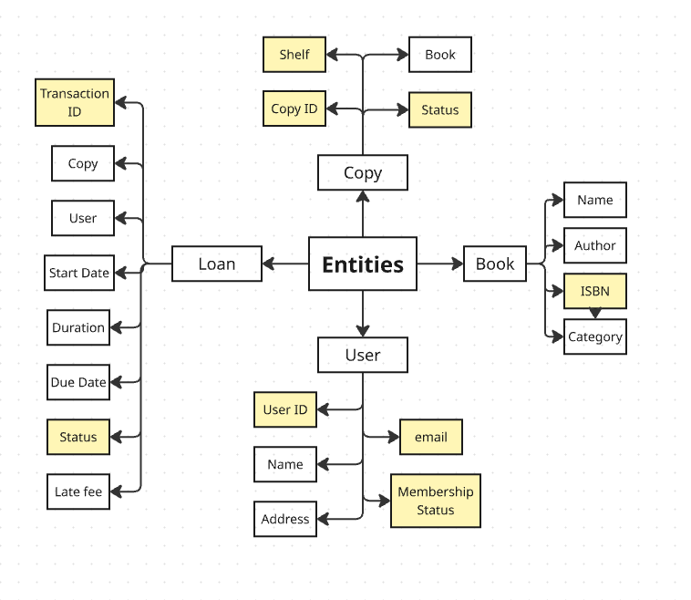

# Clean-Architecture-Practice
I'm trying to learn clean architecture for industry standard code writing. I'm following the example from Claudio Shigueo Watanabe's article and git repository. I'm building a blueprint for Library Management Sytem. 

## Entity Mapping:

 This image shows the basic entities that are to be calibrated in the first inner layer i.e <b> Entities </b> layer. So the required entities are: 

- Book
- User
- Copy
- Loan

 The higlighted properties of the entities are <b> Value Object </b>. By definition, value objects are of immutable form but of variable value. A certain analogy corresponding to it would me money, i.e. Money is of same currency be it dollar, rupee etc. but what we will compare is the value of that money. Hence, dollar and rupee would be separate VOs but 5 and 10 dollar bill are comparable. 
 
